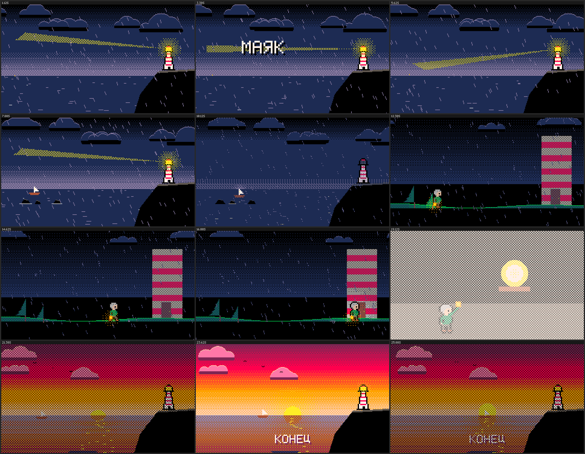
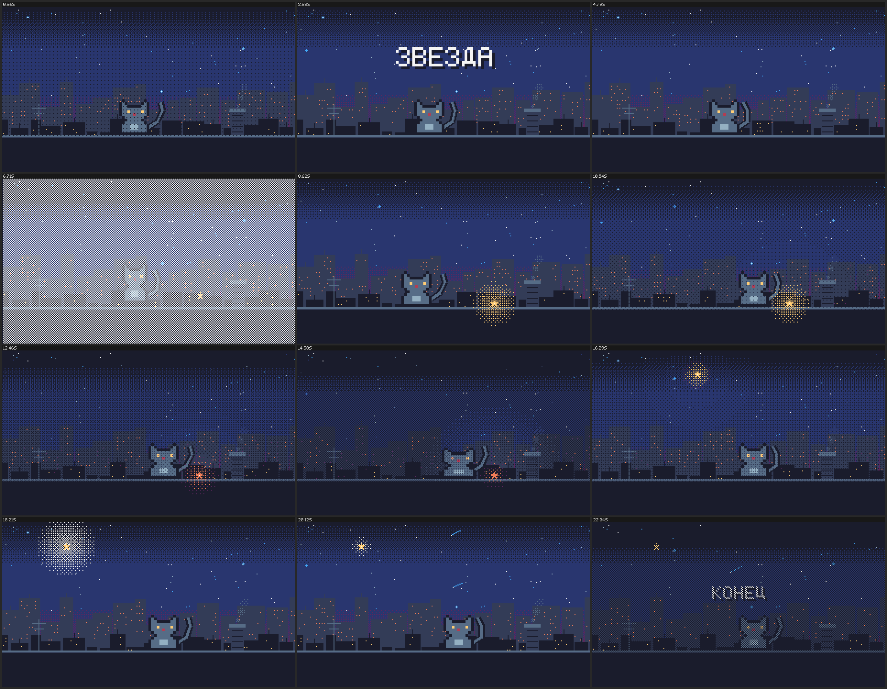
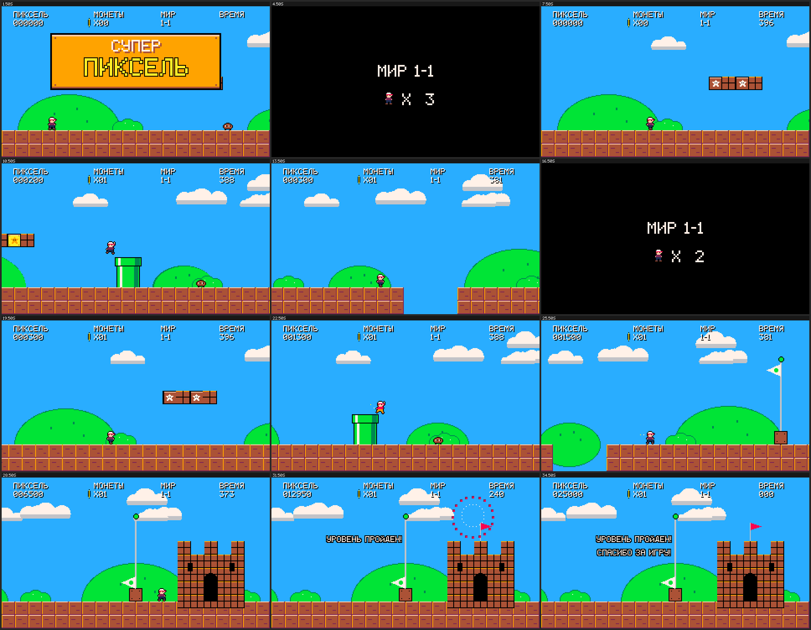

# pixel-art-video — скилл для Claude: пиксель-арт видео кодом

[English](README.md) · **Русский**

Скилл учит Claude придумывать сюжет и делать из него готовый пиксель-арт ролик
(MP4 или GIF) с 8-битной музыкой и звуками. Всё создаётся кодом на Python:
без нейросетей для картинок, без видеоредактора, без готовых ассетов.

Попросите Claude, например:
- «сделай пиксельный мультик про кота на крыше»
- «придумай сюжет и сделай 30-секундное видео в стиле старых игр»
- «вертикальный ролик для Shorts: робот находит цветок на свалке»
- «lofi-луп: комната, дождь за окном»

| Маяк (27 с) | Звезда (23 с) | Супер Пиксель (36 с) |
|---|---|---|
|  |  |  |

## Что внутри

```
pixel-art-video/
├── SKILL.md              инструкция для Claude: процесс «сюжет → код → ревью → видео»
├── scripts/pixelvid.py   движок: палитры, пиксельный шрифт (латиница + кириллица),
│                         спрайты из ASCII, персонаж с ходьбой, дождь/снег/огонь/облака,
│                         свет и ночь, отражения, переходы, субтитры, таймлайн сцен,
│                         чиптюн-синтезатор (мелодия, бас, аккорды, барабаны, 15 sfx)
├── references/
│   ├── story.md          как придумывать сюжеты: форматы, биты, генератор идей
│   ├── craft.md          правила пиксель-арта для видео + чек-лист ревью
│   └── api.md            шпаргалка по движку и нотации музыки
├── examples/             template.py + три готовых фильма (исходники роликов выше)
└── previews/             превью примеров
```

## Установка

Нужен Python 3.10+ и пакеты:

```bash
pip install pillow numpy imageio imageio-ffmpeg scipy
```

`imageio-ffmpeg` скачивает свой ffmpeg, отдельно его ставить не нужно; `scipy` необязателен.

- **Claude Code:** распакуйте архив так, чтобы получилось
  `~/.claude/skills/pixel-art-video/SKILL.md` (на Windows:
  `C:\Users\<имя>\.claude\skills\pixel-art-video\SKILL.md`), и начните новую сессию.
- **Claude.ai / Claude Desktop:** загрузите zip в настройках, в разделе Skills (нужна
  включённая функция выполнения кода).

Если скилл лежит не в `~/.claude/skills/`, укажите путь к движку в переменной окружения
`PIXELVID_DIR=<путь>/pixel-art-video/scripts`. Claude и сам поправит путь в `film.py`.

## Запуск примеров без Claude

```bash
cd pixel-art-video/examples
python lighthouse.py preview out      # лист стоп-кадров для проверки
python lighthouse.py render out       # MP4 1280×720 со звуком
python super_pixel.py gif out         # GIF
```

Режимы: `preview`, `stills 1.5,7,12`, `render`, `gif`, `wav`.

## Благодарности

Палитры с [Lospec](https://lospec.com/palette-list): PICO-8 (Lexaloffle),
Sweetie 16 (GrafxKid), Endesga 32 (ENDESGA), SLSO8, NYX8, классическая палитра Game Boy.
«Супер Пиксель» — оригинальный ролик в жанре платформера: персонажи, графика и
музыка свои, не взяты из существующих игр.

## Лицензия

[MIT](LICENSE): можно свободно использовать, менять и распространять, в том числе
в коммерческих целях, при условии сохранения уведомления об авторских правах.
